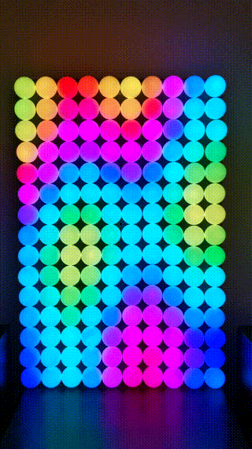

# Ping Pong Pi

A system enabling a Raspberry Pi to drive a wall of addressable LEDs to display interesting images.

## Software Installation

1 - Create a directory `/home/pi/pingpongpi` on your Raspberry Pi

2 - Run `deploy.sh`

3 - Use the systemd scripts in `setup/` to set up the services

4 - Configure it depending on your screen size, neopixel type using the config
values in `daemon/run.py`

## User guide
Navigate to your pi in your web browser, and you should see the various options for control

## Building the hardware
1 - Build a case

2 - Fit the neopixels in it. In particular they need to be laid out left->right/right->left in alternating rows, like this:
   ------------------------\
      ______________________/
     /
     \______________________ etc....
 
3 - Use a guide like this https://learn.adafruit.com/neopixels-on-raspberry-pi to wire it to your Pi

## Writing plugins
See `fire.py` for a simple example of building a plugin. Currently you have to manually add the plugin into both the web ui and the screen daemon
